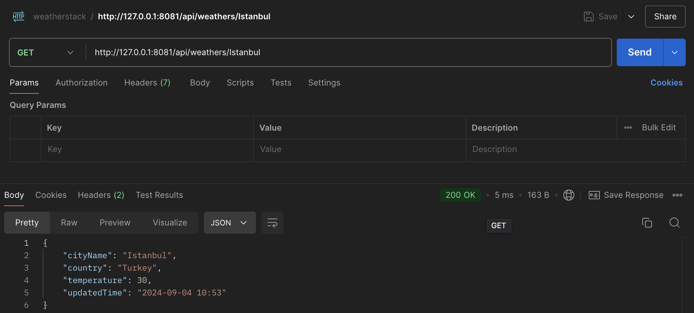
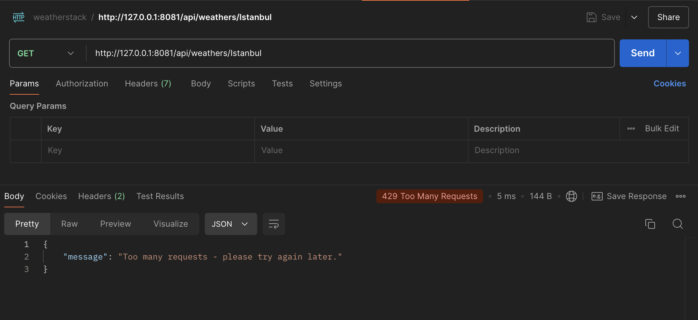
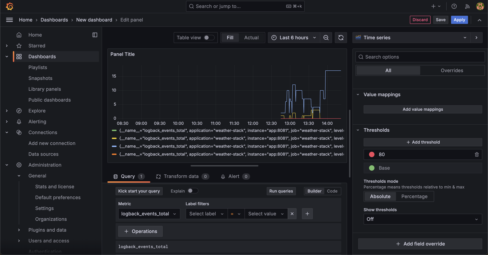
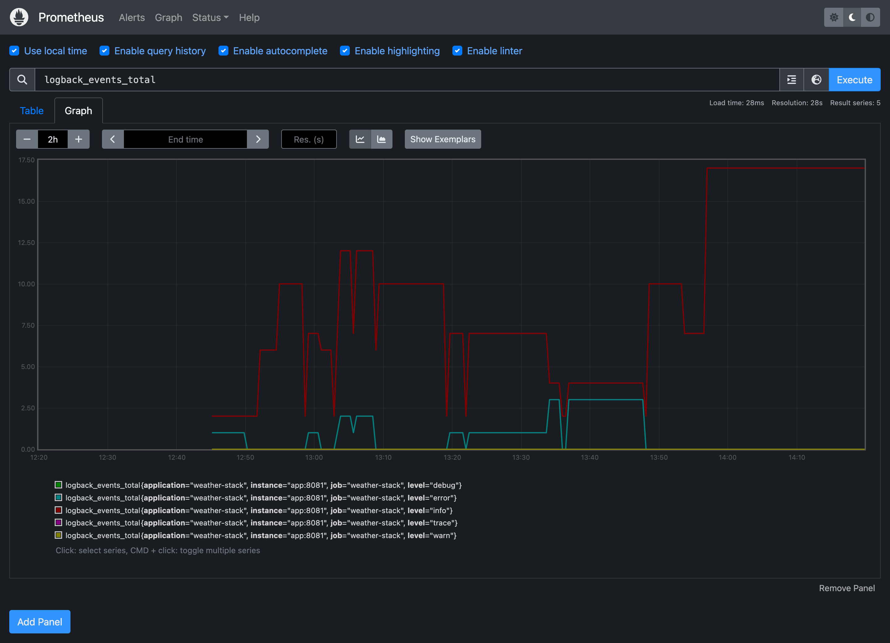

# Reactive WebFlux ve WeatherStack API ile Hava Durumu Sorgulama

Bu proje, Spring Boot kullanılarak geliştirilen reactive programlamaya uygun bir hava durumu uygulamasıdır. Proje, WeatherStack API'si ile entegrasyon sağlayarak kullanıcının talep ettiği şehirlerin hava durumunu sunar.
Uygulama, Reactive WebFlux, MongoDB, Prometheus, Grafana, Rate Limiting ve Docker gibi modern teknolojiler ile geliştirilmiştir.
Temel amaç, verimli ve ölçeklenebilir bir hava durumu servisi sağlamaktır.

## Özellikler

- **Reactive WebFlux:** Proje tamamen reaktif mimari ile inşa edilmiştir, böylece yüksek performanslı ve asenkron veri akışları sağlanmaktadır.
- **MongoDB:** Hava durumu verileri MongoDB'de bir **document** olarak saklanır.
- **WeatherStack API:** İlgili şehre yapılan hava durumu sorguları, son 60 dakika içinde yapılmışsa, WeatherStack API'ye tekrar gitmeden veritabanından getirilir. Burada amaç sınırlı sayıda istek atabildiğimiz API'yi verimli kullanabilmektir.
- **Rate Limiting:** WeatherStack API'ye gönderilen istekler, **Resilience4j** kullanılarak sınırlandırılır (Rate Limiter). Aynı anda çok fazla istek yapılmasını önleyerek API'nin korunması sağlanır.
- **Prometheus ve Grafana:** Performans izleme ve monitoring işlemleri için **Prometheus** ve **Grafana** entegre edilmiştir.
- **Docker:** Uygulama tamamen Dockerize edilmiştir, böylece kolayca dağıtılabilir ve yönetilebilir.

## Teknolojiler

- **Spring Boot (Reactive WebFlux)**
- **MongoDB**
- **WeatherStack API (https://weatherstack.com/documentation)**
- **Resilience4j (Rate Limiting)**
- **Prometheus & Grafana**
- **Docker**

### Adımlar

1. **Proje Kopyalama:**  
   `git clone https://github.com/kullaniciadi/proje-adi.git`

2. **Bağımlılıkları Yükleme:**  
   `mvn clean install`

3. **Docker İmajı Oluşturma ve Çalıştırma:**  
   `docker-compose up --build`

4. **Prometheus ve Grafana'ya Erişim:**
    - Prometheus için: `http://localhost:9090`
    - Grafana için: `http://localhost:3000`

5. **Uygulamanın Çalıştırılması:**  
   `mvn spring-boot:run`


## Kullanım

Uygulamayı çalıştırdıktan sonra, herhangi bir şehir için hava durumu sorgusu yapabilirsiniz.

### API Endpoint

**GET /api/weathers/{cityName}**
- `cityName`: Hava durumu bilgisi alınacak şehrin adı.

**Örnek İstek:**
GET /api/weathers/Istanbul


Bu istek, İstanbul şehrinin hava durumunu döner. Eğer bu şehirle ilgili veri daha önce alınmış ve 60 dakika geçmemişse, veritabanındaki önbelleklenmiş sonuç dönecektir. Aksi halde WeatherStack API'sine istek yapılır ve veri MongoDB'ye kaydedilir.


### Rate Limiter

- **Limit for Period:** 10 istek (1 dakika içinde en fazla 10 istek yapılabilir).
- **Timeout Duration:** 10 saniye (limit aşıldığında isteklerin cevap süresi).
  
Rate Limiting ayarları `application.yml` dosyasında aşağıdaki gibi yapılandırılmıştır:

```yaml
resilience4j:
  ratelimiter:
    instances:
      basic:
        limit-for-period: 10
        limit-refresh-period: 1m
        timeout-duration: 10s
```

Prometheus ve Grafana
Prometheus, uygulama ile ilgili metrikleri toplamak için kullanılır. Grafana ise bu metrikleri görselleştirmek için kullanılır. Prometheus'a http://localhost:9090 ve Grafana'ya http://localhost:3000 üzerinden erişebilirsiniz.
Grafana'da Prometheus'u veri kaynağı olarak ekleyip uygulama performansını izleyebilirsiniz.

